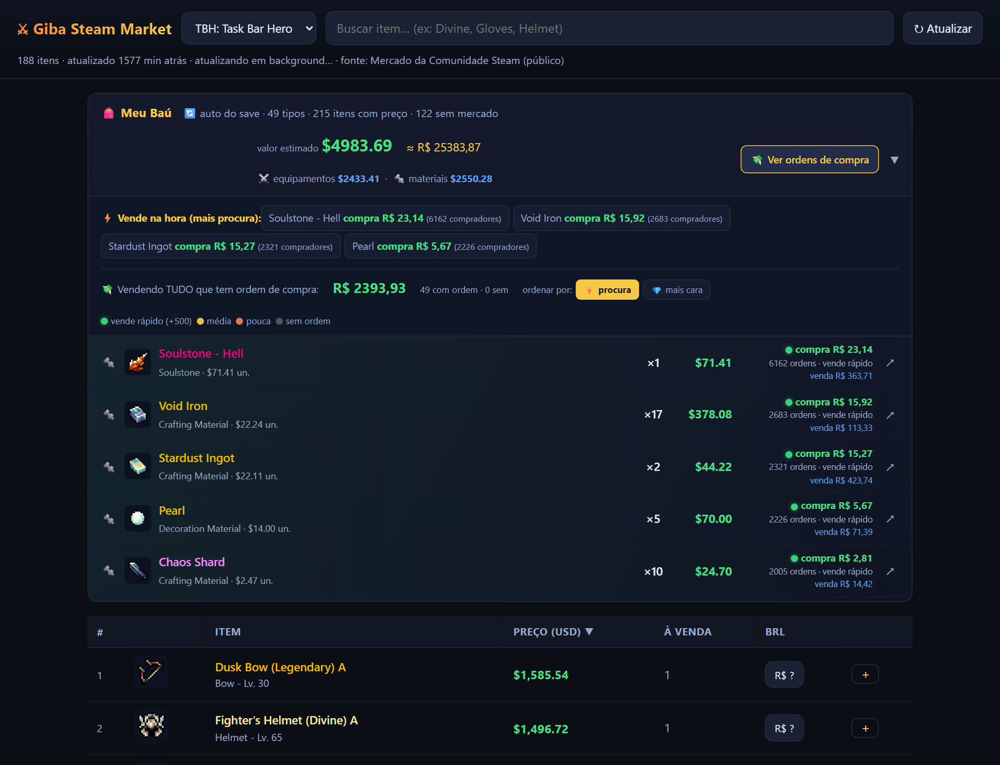

# 🎒 Giba Steam Market

**Descubra quanto vale o seu baú no TBH: Task Bar Hero — sem abrir a Steam e sem digitar nada.**



> [!IMPORTANT]
> ### 🆕 Atualização 14/06/2026 — agora mostra quem QUER COMPRAR seus itens!
> Tem um botão novo no seu baú: **"💸 Ver ordens de compra"**. Quando você clica, o app mostra, pra cada item que você tem:
> - 🟢 **Por quanto dá pra vender NA HORA** (a "ordem de compra" = gente que já está esperando pra comprar).
> - 🔵 **O preço de venda mais barato** na Steam (pra você comparar).
> - **Quantas pessoas querem comprar** aquele item (quanto mais gente, mais rápido vende).
>
> **Por que isso ajuda:** em vez de colocar um item à venda e ficar esperando alguém aparecer, você vê o que tem comprador na fila e vende **na hora**. Dá pra ordenar por **"⚡ vende mais rápido"** ou por **"💎 maior preço"**.
>
> _(As atualizações anteriores — instalação automática e correção do "Acesso Negado" — continuam valendo. Veja o histórico no fim desta página.)_

O que ele mostra:

- 💰 **O valor total do seu inventário** (equipamentos + materiais), lido direto do save do jogo.
- 💸 **Quem quer comprar seus itens e por quanto** — pra vender rápido (botão "Ver ordens de compra").
- 🔎 **Os preços do Mercado da Steam** de todos os itens, do mais caro pro mais barato, com busca.
- 🪙 Preço em **dólar e em real (R$)**.

Feito por **[EuSouOGiba](https://eusouogiba.com)** · [youtube.com/@eusouogiba](https://youtube.com/@eusouogiba)

---

## 🚀 Como instalar (3 passos, sem saber NADA de programação)

### 1️⃣ Baixe o app

Clique no botão verde **`<> Code`** lá em cima nesta página → **Download ZIP**.

### 2️⃣ Extraia o ZIP (não pule isso!)

1. Vá na pasta **Downloads** e ache o arquivo `giba-steam-market-main.zip`.
2. Clique nele com o **botão DIREITO** do mouse → **"Extrair Tudo..."** → **Extrair**.
3. Vai aparecer uma **pasta nova** com o mesmo nome. Entre nela.

> ⚠️ **Não rode o app de dentro do ZIP!** Dar dois cliques no ZIP só "espia" dentro dele — você precisa extrair de verdade (passo acima), senão dá erro.

### 3️⃣ Dê dois cliques em `start-steam-market.bat`

- Vai abrir uma **janela preta** — é normal, é o app trabalhando! Pode minimizar.
- Se for a primeira vez, ele **instala sozinho** o que precisa (Node.js, gratuito e oficial). Se o Windows perguntar algo, clique em **Sim**.
- Em alguns segundos **o navegador abre sozinho** com o seu baú preenchido. Pronto! 🎉

> 💡 **"O Windows protegeu o seu computador"** (tela azul)? Isso é o aviso padrão do Windows pra QUALQUER arquivo baixado da internet. Clique em **"Mais informações"** → **"Executar assim mesmo"**.

**Da próxima vez:** só dar os dois cliques no `start-steam-market.bat` de novo. Nada mais.

---

## ✅ É seguro? Vou tomar ban?

**Não.** Esse app **só LÊ arquivos** que já estão no seu computador. Ele:

- ✅ Lê uma **cópia** do save do jogo (na memória) só pra calcular o valor.
- ✅ Usa os mesmos endereços públicos de preço que o site da Steam usa.
- ❌ **NÃO** modifica o seu save.
- ❌ **NÃO** mexe no jogo enquanto ele roda (não injeta nada, não trapaceia).
- ❌ **NÃO** automatiza compra/venda.
- ❌ **NÃO** envia seus dados pra lugar nenhum (roda 100% no seu PC).

Ban acontece quando alguém **modifica** o save pra trapacear ou automatiza trocas. Nada disso é feito aqui. É leitura passiva, como abrir o arquivo no Bloco de Notas.

> ⚠️ Ainda assim, use por sua conta e risco. Este é um projeto da comunidade, sem vínculo com a Valve ou com os criadores do TBH.

---

## 💸 Ver quem quer comprar seus itens (vender rápido)

No seu baú tem o botão **"💸 Ver ordens de compra"**. Clica nele e espera uns segundos (o app pergunta pra Steam item por item, com calma pra não ser bloqueado).

Aí, pra cada item você vê:

- 🟢 **compra R$ X** — quanto você recebe **vendendo na hora**. Tem gente já esperando pra comprar por esse valor.
- 🔵 **venda R$ Y** — o anúncio mais barato à venda na Steam (só pra você comparar).
- **Quantos compradores** estão na fila. Quanto mais, mais rápido vende. A bolinha verde/amarela/laranja mostra isso de relance.

No topo aparece **"Vendendo TUDO que tem ordem de compra: R$ ..."** — quanto você embolsaria vendendo tudo agora mesmo.

**Dica:** use o botão **ordenar por** pra alternar:
- **⚡ procura** — mostra primeiro o que vende mais rápido (mais compradores na fila).
- **💎 mais cara** — mostra primeiro a ordem de compra de maior valor.

Assim você decide na hora: despejar o que sai rápido, ou priorizar o que rende mais. 🤑

---

## 🆘 Deu erro? (problemas comuns)

A janela preta agora **te diz o que fazer** na maioria dos erros. Mas aqui vai a colinha:

| O que apareceu | O que fazer |
|---|---|
| **"O Windows protegeu o seu computador"** | Aviso padrão pra arquivo baixado. **"Mais informações" → "Executar assim mesmo"**. |
| **"Arquivos do app nao encontrados"** | Você rodou de dentro do ZIP. Extraia primeiro (Passo 2️⃣). |
| **"Acesso negado... nao deixa gravar nesta pasta"** | Mova a pasta inteira do app pra **Documentos** (ou `C:\giba-steam-market`) e rode de lá. Evite "Arquivos de Programas". |
| **"Acesso negado" na porta / página não abre** | O app novo resolve sozinho: ele pula pra outra porta e abre o navegador certo. Baixou antes de 12/06/2026? Baixe o ZIP de novo. |
| **"Nao consegui instalar o Node.js automaticamente"** | Instale manual: [nodejs.org](https://nodejs.org) → botão verde **LTS** → Avançar até o fim → rode o .bat de novo. |
| **"save do TBH não encontrado"** | Abra o jogo TBH pelo menos uma vez (pra ele criar o save) e clique em Atualizar. |
| **"assets do TBH não encontrados"** | Jogo instalado em pasta incomum — veja **"Steam em outra pasta"** abaixo. |
| Materiais sem nome na lista | Normal, é opcional — veja **"Mostrar nomes dos materiais"** abaixo. |
| Página não abre sozinha | Olhe a janela preta: ela mostra o endereço (ex: `http://localhost:5260`). Digite ele no navegador. |

Nada disso resolveu? **[Abra uma issue aqui](../../issues)** contando o que apareceu na janela preta (print ajuda muito!) que a gente te ajuda. 🤝

### Steam em outra pasta

O app procura o TBH automaticamente nos drives C, D, E… Se você instalou em um lugar incomum, descubra a pasta `TaskBarHero_Data` (clique direito no jogo na Steam → Gerenciar → Procurar arquivos locais) e rode assim, trocando o caminho:

```bat
set TBH_GAME_DIR=D:\MinhaPasta\TaskbarHero\TaskBarHero_Data
start-steam-market.bat
```

---

## 🔩 Mostrar os nomes dos materiais (opcional)

Os **equipamentos** (espadas, armaduras) já aparecem com preço sem configurar nada.

Os **materiais** (Void Iron, Phoenix Ash…) têm nome próprio guardado de forma compactada no jogo. Pra destravar os nomes deles, rode uma vez:

1. Instale o Python: 👉 https://www.python.org/downloads (marque "Add Python to PATH" na instalação).
2. Abra a janela preta na pasta do app e rode:
   ```bat
   pip install UnityPy
   npm run extract-tables
   ```
3. Reinicie o app. Agora os materiais aparecem com nome e preço também.

Sem isso, o app funciona normal — só não soma os materiais que têm nome próprio.

---

## 🎮 Funciona com outros jogos da Steam?

Sim! No topo do app tem um seletor de jogo (CS2, TF2, Dota 2, Rust, ou qualquer AppID). Pra esses, a **lista de preços e a busca** funcionam. O **baú automático** é exclusivo do TBH (cada jogo guarda o save de um jeito).

---

## 🤖 Vai usar uma IA (ChatGPT, Claude) pra te ajudar?

Se você quer que uma IA te ajude a instalar, modificar ou consertar este app, **mostre pra ela o arquivo [`AI-SETUP.md`](AI-SETUP.md)**. Ele explica pra IA exatamente como o sistema funciona e como se comportar pra não quebrar nada (nem te colocar em risco).

---

## 🛠️ Pra quem é técnico

- **Stack:** Node puro (sem dependências), servidor HTTP + UI HTML única. Python+UnityPy só pra extrair nomes de materiais (opcional).
- **Launcher:** o `.bat` valida ambiente (ZIP extraído, permissão de escrita), resolve/instala Node via winget e sobe o server. O server faz fallback de porta (5260→+20) quando a base cai em faixa reservada do Windows (`netsh int ipv4 show excludedportrange`) e abre o browser na porta real.
- **Preços:** endpoints públicos `steamcommunity.com/market/search/render` e `/priceoverview`, com throttle e cache em disco.
- **Ordens de compra:** endpoint público `market/orderbook?q=Load&qp=[appid,"hash"]` (usado pela UI nova da Steam) — retorna maior ordem de compra, menor ordem de venda e nº de ordens, sem precisar de `item_nameid`. Batch dos itens do baú no server (`/api/stash-orders`, throttle ~650ms, cache 3min).
- **Save:** Easy Save 3 (AES-128-CBC, PBKDF2-SHA1). A chave fica em texto plano nos assets do jogo e é auto-extraída.
- **Mapeamento item→preço:** tabela mestra dos assets (`ItemKey → grade/tipo/nível`) casa com o `type` do mercado; materiais via localização Unity.
- Detalhes em [`AI-SETUP.md`](AI-SETUP.md).

---

## 📜 Histórico de atualizações

- **14/06/2026** — Botão "💸 Ver ordens de compra": mostra quem quer comprar seus itens e por quanto, pra vender rápido. Ordenação por procura ou por preço.
- **12/06/2026** — Instalação automática (o app instala o Node.js sozinho) e correção do erro "Acesso Negado" (porta bloqueada pelo Windows). Mensagens de erro em português.
- **09/06/2026** — Primeira versão: valor do baú do TBH + preços do Mercado da Steam.

---

## 📄 Licença

MIT — use, modifique e compartilhe à vontade. Se ajudar, deixa uma estrela ⭐ e se inscreve no canal!

**EuSouOGiba** · [youtube.com/@eusouogiba](https://youtube.com/@eusouogiba) · [eusouogiba.com](https://eusouogiba.com)
